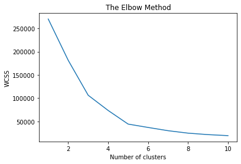
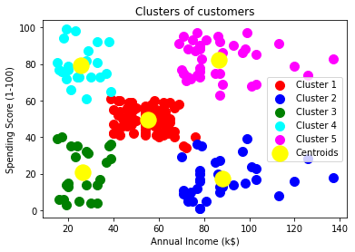

# K-means_clustering

I try to cluster the data based on the features such as age, gender, annual income, and spending score. Customer behavior and purchase data are among the aspects that influence a consumer's spending Score. I used the elbow method to choose the number of clusters by fitting the model with a range of values for K. K=5 cluster has been created.

```bash
$ pip install -r requirement.txt
```



